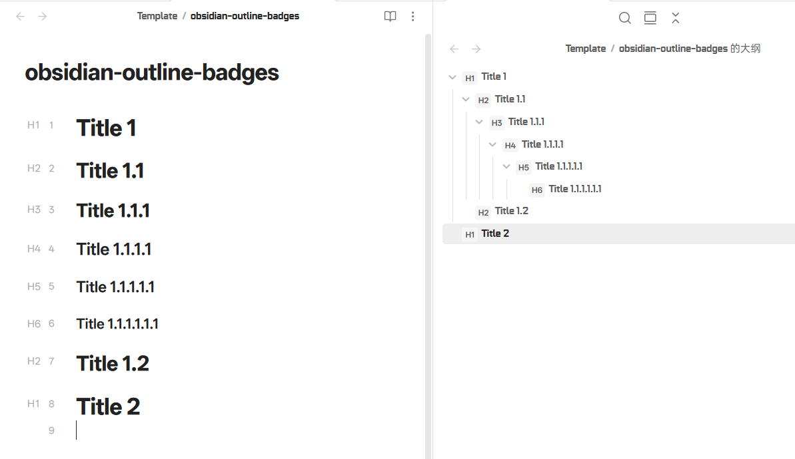
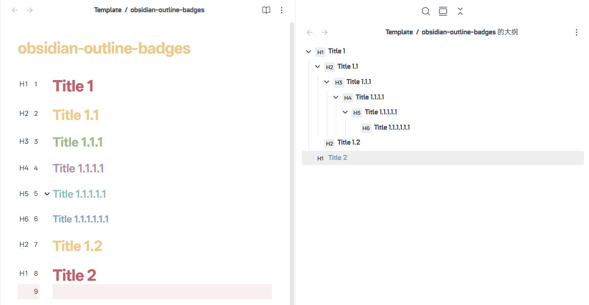

# Obsidian Outline Badges

[English](./README.md) | 中文

为 Obsidian 大纲面板添加 H1-H6 级别徽章显示。


## 效果预览



## 功能特点

- 在大纲面板显示 H1-H6 级别徽章
- 徽章显示在每个标题前面
- 跟随主题配色
  - 

## 安装方法

1. 从 [GitHub Releases](https://github.com/LrRui20/obsidian-outline-badges/releases) 下载`main.js`, `styles.css`, 和 `manifest.json`文件
2. 在你的仓库`/.obsidian/plugins`目录下创建`obsidian-outline-badges`文件夹
3. 将下载的三个文件放入`obsidian-outline-badges`文件夹中
4. 在设置 → 社区插件中启用插件

## 自定义样式

编辑 `styles.css` 可以自定义徽章样式：

```css
/* 徽章基础样式 */
.outline-level-badge {
  min-width: 20px;      /* 徽章宽度 */
  height: 18px;          /* 徽章高度 */
  margin-right: 4px;     /* 与标题的间距 */
  padding: 0 1px;        /* 内边距 */
  border-radius: 3px;    /* 圆角大小 */
  font-size: 10px;      /* 字体大小 */
  font-weight: 600;     /* 字体粗细 */
  color: var(--text-muted);       /* 文字颜色 */
  background: var(--background-secondary); /* 背景色 */
  border: 1px solid var(--border-color);  /* 边框颜色 */
}
```

## 自行构建

如果你想自行修改代码并构建插件：

### 前置要求

- [Node.js](https://nodejs.org/) (v18+)
- [npm](https://www.npmjs.com/)

### 构建步骤

```bash
# 1. 克隆仓库
git clone https://github.com/LrRui20/obsidian-outline-badges.git
cd obsidian-outline-badges

# 2. 安装依赖
npm install

# 3. 构建插件
npm run build
```

构建完成后，会在项目根目录生成 `main.js` 文件。

### 项目结构

```
obsidian-outline-badges/
├── main.ts          # 插件源代码
├── styles.css       # 徽章样式
├── manifest.json    # 插件清单
├── esbuild.config.mjs  # 构建配置
└── tsconfig.json    # TypeScript 配置
```

## 或使用snippets片段
我已经弃用的snippets片段，它不能正确的读取大纲层级，所以不推荐使用了，如果你想使用snippets片段，可以按照以下步骤：

1. 在你的仓库`/.obsidian/snippets`目录下新建一个`outline-badges.css`文件
2. 将下述 CSS 代码复制粘贴到新建的`outline-badges.css`文件中

```css
 /* Obsidian 大纲标题层级徽章 */
.workspace-leaf-content[data-type="outline"] .tree-item-self {
  position: relative;
}

/* 使用 ::before 伪元素显示徽章 */
.workspace-leaf-content[data-type="outline"] .tree-item-self::before {
  content: "";
  display: inline-flex;
  align-items: center;
  justify-content: center;
  min-width: 20px;
  height: 18px;
  margin-right: 4px;
  padding: 0.5px;
  border-radius: 3px;
  font-size: 10px;
  font-weight: 600;
  font-family: var(--font-text);
  color: var(--text-muted);
  background: var(--background-secondary);
  border: 1px solid var(--border-color);
  position: relative;
  top: 1px;
}

/* 根据 margin-inline-start 推断层级 */
.workspace-leaf-content[data-type="outline"] .tree-item-self[style*="padding-inline-start: 24px"]::before {
  content: "H1";
}

.workspace-leaf-content[data-type="outline"] .tree-item-self[style*="padding-inline-start: 41px"]::before {
  content: "H2";
}

.workspace-leaf-content[data-type="outline"] .tree-item-self[style*="padding-inline-start: 58px"]::before {
  content: "H3";
}

.workspace-leaf-content[data-type="outline"] .tree-item-self[style*="padding-inline-start: 75px"]::before {
  content: "H4";
}

.workspace-leaf-content[data-type="outline"] .tree-item-self[style*="padding-inline-start: 92px"]::before {
  content: "H5";
}

.workspace-leaf-content[data-type="outline"] .tree-item-self[style*="padding-inline-start: 109px"]::before {
  content: "H6";
}

/* 如果上面不生效，尝试使用更通用的选择器 */
.workspace-leaf-content[data-type="outline"] .tree-item > .tree-item-self::before {
  content: "H1";
}

.workspace-leaf-content[data-type="outline"] .tree-item > .tree-item-children > .tree-item > .tree-item-self::before {
  content: "H2";
}

.workspace-leaf-content[data-type="outline"] .tree-item > .tree-item-children > .tree-item > .tree-item-children > .tree-item > .tree-item-self::before {
  content: "H3";
}

.workspace-leaf-content[data-type="outline"] .tree-item > .tree-item-children > .tree-item > .tree-item-children > .tree-item > .tree-item-children > .tree-item > .tree-item-self::before {
  content: "H4";
}

.workspace-leaf-content[data-type="outline"] .tree-item > .tree-item-children > .tree-item > .tree-item-children > .tree-item > .tree-item-children > .tree-item > .tree-item-children > .tree-item > .tree-item-self::before {
  content: "H5";
}

.workspace-leaf-content[data-type="outline"] .tree-item > .tree-item-children > .tree-item > .tree-item-children > .tree-item > .tree-item-children > .tree-item > .tree-item-children > .tree-item > .tree-item-children > .tree-item > .tree-item-self::before {
  content: "H6";
}
```
3. 在设置 → 外观 → CSS代码片段中启用 `outline-badges.css` 片段

## 开源协议

MIT License - see [LICENSE](LICENSE)
